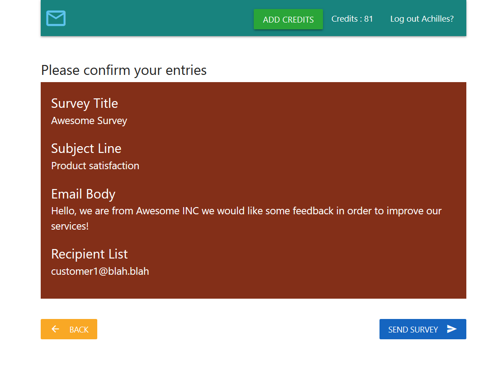
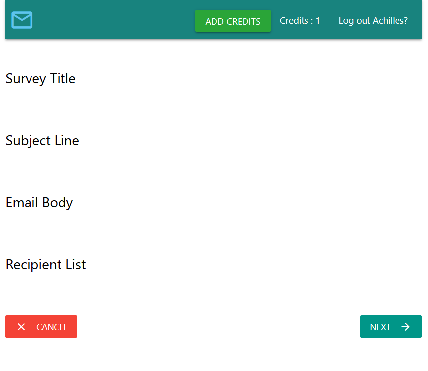

# Emaily
MERN stack application , some features:

- Authentication with Google OAuth
- Cookie based
- Heroku ready
- Mongo DB on the cloud
- Payments with Stripe
- Sends emails with sendgrid API

## Logged in
### Creating a new Survey
1. Insert data

2. Review before sending survey

### View your surveys

## Landing page

