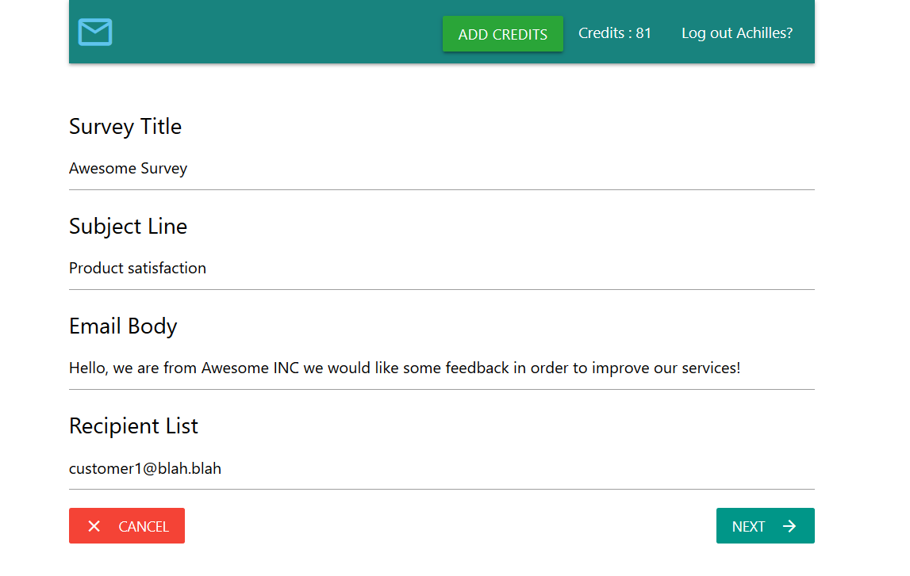

# Emaily
MERN stack application , some features:

- Authentication with Google OAuth
- Cookie based
- Heroku ready
- Mongo DB on the cloud
- Payments with Stripe
- Sends emails with sendgrid API

### What is it
Emaily allows a user to create an account using his/her Google credentials. The user can :
1. Create email surveys and send them in a list a recipients
2. Pay with Stripe for getting email creds
3. Access to history of sent surveys
4. Deleting surveys

## Logged in
### Creating a new Survey
1. Insert data

2. Review before sending survey

### View your surveys

## Landing page

